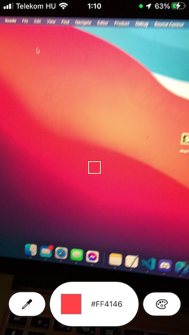
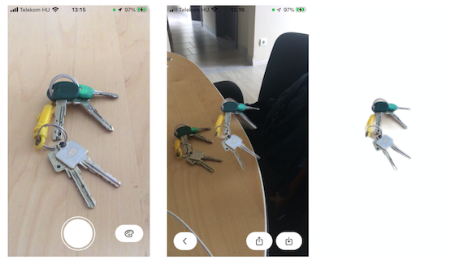

ARToolsMVP is an iOS app for experinmental AR tools

## AR Color Picker
Picks the average color of pixels within a rectange in the midle of the camera image.  
*Usage:* Switch on/off with palette icon, get color with eydropper icon

## AR Copy-and-paste Tool
Salient Object Detection based background removal.  
*Usage:* Take a picture, wait for object detection. The image of the salient object without background can be shared or saved to phone.

### Object detection
todo
